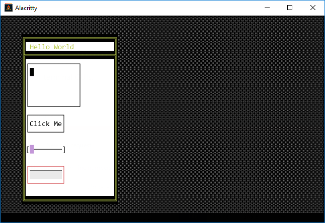
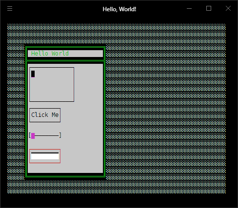
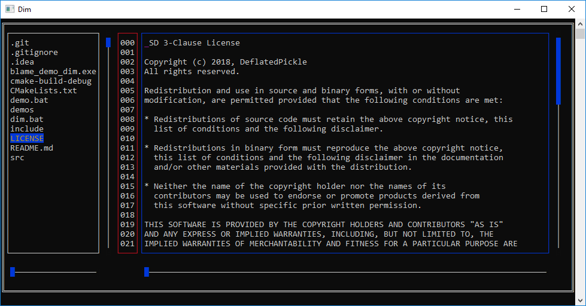
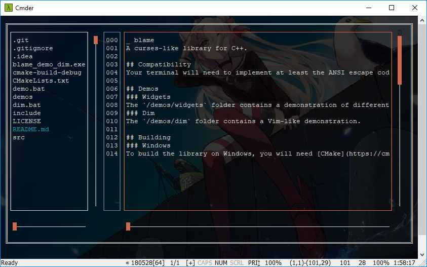

# blame
A curses-like library for C++.

## Compatibility
Your terminal will need to implement at least the ANSI escape code for moving the caret for Blame to look readable, and the font used will need to support the [block elements](https://en.wikipedia.org/wiki/Block_Elements) and [box drawing](https://en.wikipedia.org/wiki/Box_Drawing) unicode blocks.

## Demos
### Widgets
The `/demos/widgets` folder contains a demonstration of different widgets offered by Blame.

The Widget showcase demo as of commit [fd6bd1d](https://github.com/DeflatedPickle/blame/commit/fd6bd1d6d46f9194eff2150310479505b4d70d36):

### Dim
The `/demos/dim` folder contains a Vim-like demonstration.

The Dim demo as of commit [4eb183f](https://github.com/DeflatedPickle/blame/commit/4eb183ff8300f6145f8b0ce93247f7468c3f9197):

### Bi.Sh
Coming soon - A shell.

### Pitty
Coming soon - A terminal emulator (inside a terminal emulator, potentially, inside a terminal emulator).

## Building
### Windows
To build the library on Windows, you will need [CMake](https://cmake.org/) 3.13 or higher and [Cygwin](https://www.cygwin.com/) 2.11.2 or higher (Cygwin is required as it is the only, to my knowledge, GNU tool distribution on Windows to support libraries such as `termios` and `ioctl`).

## Alternatives
- [ncurses](https://www.gnu.org/software/ncurses/ncurses.html)
- [dialog](https://invisible-island.net/dialog/)
- [Newt](https://pagure.io/newt)
- [Turbo Vision](http://tvision.sourceforge.net/)

## License
